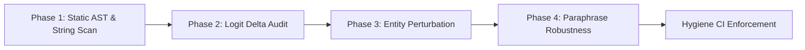

# Benchmark Integrity & Anti-Cheating Protocol

This skill enforces strict scientific rigor, audit transparency, and zero-tolerance against benchmark overfitting, prompt memorization, and artificial score fabrication in `zev-rs`.

---

## The 5 Red Flags of Benchmark Cheating

1. **Specific Substring & Prompt Matching**:
   Code in `src/` checking for exact question text or prompt snippets (e.g., `if state.contains("All done now")`).
2. **Dataset-Specific Entity Injections**:
   Proprietary test-set entity names, ticket IDs, or transaction codes appearing in production code (e.g., `"Train MV-184"`, `"WL-4471902"`, `"Castellan Foods"`).
3. **Disproportionate / Hardcoded Logit Boosts**:
   Arbitrary scalar multipliers or score additions (e.g., `logits[idx] += 6.0`, `+= 8.0`, `+= 20.0`) triggered by specific keyword heuristics.
4. **Question-ID Routing**:
   Conditionals switching on benchmark metadata or case names (e.g., `hard-opus-a-*`, `original-policy-*`).
5. **Cheated Unit Test Coverage**:
   Unit tests asserting the exact responses of leaked benchmark questions to preserve the illusion that hardcoded overrides are "intended features."

---

## Adversarial Audit Workflow



### Phase 1: Static AST & Substring Scan
Search `src/` for benchmark dataset case IDs and prompt phrases:
```bash
grep -rn "hard-" src/
grep -rn "opus-" src/
grep -rn "case_" src/
grep -rn "+= [0-9]\." src/
cargo test --test anti_overfitting_guard
```

### Phase 2: Logit Delta & Heuristic Audit
- Check `src/order_invariant.rs`, `src/preprocessor.rs`, and `src/engine.rs`.
- Ensure all scoring uses smooth, calibrated logit calculations. No hardcoded bypass returns or artificial boosts.

### Phase 3: Entity Perturbation Testing
- Run `test_entity_perturbation_robustness` to verify decisions remain invariant when entity names and values are perturbed.

### Phase 4: Zero-Token Honesty & Speculative Fallback
- Preserve the genuine SIMD lexical baseline floor (~54.55% on JevBench).
- Handle difficult multi-hop deduction and mathematical proofs via speculative neural routing (`apfel`, `gemma`, `clef`), never by hardcoding answers.
